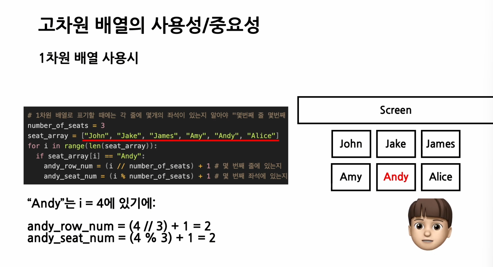

"""

< 공부 사이트 >
https://icy-muse-c2d.notion.site/adbe81ab01de4af3bf20bdf903ff0e0f

< 선형 자료구조 > 

* 항목들을 순서적으로 나열하여 저장하는 창고
* 항목 접근 방법에 따라 다시 세분화 
-> 리스트 : 가장 자유로운 선형 자료구조 
-> 스택, 큐, 덱 : 항목의 접근이 맨 앞이나 맨 뒤로 제한 
"""

"""
파이썬의 장점은 ? 
-> 편리하고 , 빠르게 코드를 작성할 수 있다. -> 제약이 많이 없기 때문 
< 코딩 테스트와 면접 상황 > 

나의 사고와 이해를 정확하고 빠르게 전달 

코딩을 하며 결정해야할 사항이 많다. 
1. 알고리즘 구상 
2. 코드 효율성 

"""

###

# 프로그래밍 언어 

"""
< 고급 프로그래밍 언어 > 

1. 코딩을 하는 사람에게 편리 
2. 코드를 적는데 제약이 적다 

< 저급 프로그래밍 언어 >

1. 기계에게 편리한 언어
2. 코드를 적는데 제약이 많다.

-> 프로그래밍에는 트레이드 오프가 존재한다. 

공간 VS 시간 

코딩 시간 VS 런타임 

"""

# 식 ( expression )

* 어떠한 값을 반환하는 코드 

-> ex. sum , 문자열 

# 문 ( statement )

* 어떠한 값을 반환하지 않지만 어떤 행위를 하는 코드 
-> ex. ) 반복문, 조건문 등 

# 자료형 ( Data Type )

-> 12, -5, + 7 -> int 

-> float -> 실수형 

# 고차원 배열을 사용하는 이유 

